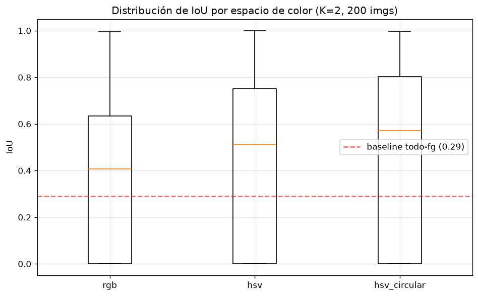
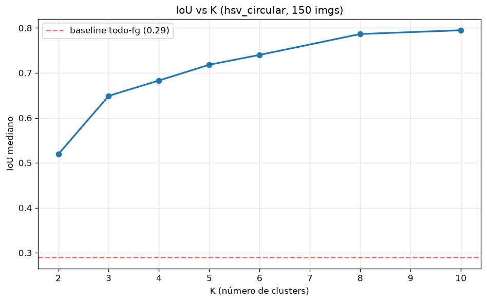

# ¿Puede K-Means segmentar objetos?

Estudio experimental de clustering visual para segmentación de imágenes. Se evalúa
hasta dónde llega K-Means para separar objeto/fondo usando solo características de
color, sin aprendizaje supervisado, y dónde se rompe.

## Pregunta central

K-Means no "comprende" imágenes: agrupa píxeles por similitud de color. Este
proyecto mide qué tan lejos llega ese enfoque, cuándo funciona y cuándo falla, y
qué factores (espacio de color, número de clusters) determinan el resultado.

## Dataset

Oxford-IIIT Pet (7390 imágenes de perros y gatos con máscaras trimap). No se
incluye en el repositorio; se descarga desde
https://www.robots.ox.ac.uk/~vgg/data/pets/ y se coloca en `data/raw/`.

Cada trimap codifica tres valores, verificados empíricamente: 1 = animal
(foreground), 2 = fondo (background), 3 = borde/ambiguo. Composición media del
dataset: 29% animal, 58% fondo, 12% borde.

## Metodología

- **K-Means por imagen** (no sobre el dataset completo): cada imagen tiene sus
  propios clusters.
- **K=2 como experimento principal** (¿separa animal de fondo?); K=2..10 como
  secundario, interpretado con cautela porque más clusters dan más grados de
  libertad para ajustarse a la máscara.
- **Mapeo cluster→clase muchos-a-uno** usando la máscara real. El IoU reportado es
  por tanto una cota superior (oracle-mapping): un sistema sin acceso a la máscara
  no sabría qué cluster es el animal.
- **Espacios de color comparados**: RGB, HSV crudo, y HSV circular ponderado por
  saturación (S·cosH, S·sinH, V), que evita que píxeles poco saturados metan ruido
  de matiz. Todas las características se estandarizan.
- **Baselines**: Otsu (umbral clásico), todo-foreground, aleatorio.
- **Evaluación**: IoU contra el trimap (ignorando el borde), reportando
  distribución completa (media, mediana, IQR), no solo el promedio.
- **Manejo de máscaras**: redimensionado nearest-neighbor (nunca bilineal, que
  inventaría etiquetas inválidas); protocolo fijo para el borde en todos los
  experimentos.
- **Reproducibilidad**: semilla fija, n_init alto, parámetros centralizados en
  `config.py`.

## Resultados

### El espacio de color importa (K=2, 200 imágenes)

| Espacio        | IoU media | IoU mediana |
|----------------|-----------|-------------|
| RGB            | 0.359     | 0.407       |
| HSV            | 0.421     | 0.511       |
| HSV circular   | 0.460     | 0.571       |



HSV supera a RGB de forma consistente, y el HSV circular ponderado resulta el
mejor en promedio. La razón: en imágenes donde el animal y el fondo difieren en
matiz pero no en brillo, los métodos basados en intensidad (RGB, Otsu) fracasan,
mientras que HSV separa por tipo de color. El IQR muy alto (~0.6–0.8) revela que
el rendimiento es **bimodal**: K-Means segmenta casi perfecto en unas imágenes y
falla por completo en otras.

### Efecto de K (HSV circular, 150 imágenes)



El IoU mediano sube con K (0.52 en K=2 hasta 0.80 en K=10) y se satura alrededor
de K=5–6. Al mismo tiempo, la variabilidad entre imágenes disminuye (IQR de 0.79
a 0.32). Sin embargo, este aumento refleja mayor capacidad de ajuste —más clusters
que el mapeo puede asignar a foreground— y no mejor comprensión del objeto. Por
eso K=2 se mantiene como la medida honesta de separación fondo/objeto.

## Conclusiones

1. La representación de color determina el resultado más que el algoritmo: HSV y
   HSV circular superan claramente a RGB.
2. Los métodos basados en brillo (RGB, Otsu) fracasan cuando objeto y fondo
   comparten intensidad pero difieren en matiz.
3. El rendimiento de K-Means es muy variable entre imágenes (bimodal), no
   uniforme: funciona bien en alto contraste de color y mal cuando las paletas se
   solapan.
4. Aumentar K mejora el IoU pero de forma engañosa (grados de libertad), con
   rendimientos decrecientes tras K≈6.

## Estructura

```
image-segmentation-kmeans/
├── data/raw/                    dataset (no versionado)
├── notebooks/
│   ├── 01_exploration.ipynb     carga, verificación del trimap, estadísticas
│   ├── 02_kmeans_segmentation.ipynb   segmentación, efecto de K, espacios de color
│   └── 03_evaluation.ipynb      IoU, baselines, evaluación a escala
├── src/
│   ├── config.py                parámetros centralizados
│   ├── preprocessing.py         carga, resize, construcción de características
│   ├── kmeans_segmentation.py   K-Means por imagen
│   ├── evaluation.py            IoU, mapeo oracle, baselines, métricas
│   └── visualization.py         comparativas y gráficas
└── results/figures/             figuras generadas
```

## Uso

```bash
pip install -r requirements.txt
```

Descargar el dataset en `data/raw/` y correr los notebooks en orden (01 → 02 → 03).

## Limitaciones y trabajo futuro

- El IoU reportado es cota superior (oracle-mapping); no mide rendimiento sin
  supervisión.
- Falta el análisis de coherencia espacial (información X,Y) y la correlación entre
  métricas internas de clustering e IoU.
- Posible extensión: validar en BSDS500 (segmentación multi-región), con métricas
  como boundary F-score.